# UCODE SEO Redesign & Preservation-First Implementation Plan

## 1. Executive Summary

UCODE (`universalcode.site`) is a dual-capability digital agency based in Sri Lanka providing:
1. **Website Design, Custom Web Development & Technical SEO Services**
2. **Social Media Management, Creative Brand Direction & Digital Marketing Services**

Currently, Google Search Console (GSC) indicates active organic impressions concentrated around informational queries—most notably Content Management Systems (CMS), website costs, and small business tech guidance. Furthermore, search queries such as *"website creation agency"* and branded searches (*"UCODE"*, *"UCODE official website"*) have registered impressions. However, high-value commercial search visibility for core target terms—such as *"web design Sri Lanka"*, *"web design company Sri Lanka"*, *"website development Sri Lanka"*, *"SEO services Sri Lanka"*, and *"social media management Sri Lanka"*—remains underdeveloped.

This plan details a **preservation-first, non-destructive SEO transformation**. In strict accordance with Absolute Rules #1 and #2:
- **Zero URL deletions or slug renames:** Every single existing URL is preserved.
- **Zero content destruction:** Informational articles currently attracting impressions (e.g., `what-is-a-cms.html`) remain intact and are strategically connected to commercial service hubs.
- **Brand and design preservation:** The sleek dark/light theme, custom aesthetic, responsive layouts, and interactive components are fully protected.
- **Technical bug fixes:** Critical schema syntax errors in existing blog articles (unclosed JSON-LD script tags) are resolved, and Open Graph/Twitter card tags and rich structured data (Organization, LocalBusiness, Service, FAQPage, BreadcrumbList) are deployed across all pages.
- **Strict Approval Gate:** No HTML, CSS, JavaScript, schema, or configuration files will be modified until explicit user approval is granted.

---

## 2. Current SEO State

An exhaustive audit of all 20 HTML files, CSS, JavaScript, metadata, schema, and sitemap assets reveals the following baseline:

1. **Topical Relevance & Keyword Architecture:**
   - Homepage H1 (`Our mission is to support you achieve your vision digitally`) lacks commercial search terminology and local geographic grounding (*Sri Lanka*).
   - `services.html` contains comprehensive sections for both web development and social media management, but its `<title>` and `<meta name="description">` omit social media marketing entirely.
   - Individual services lack descriptive anchor IDs (`#web-design`, `#web-development`, `#seo-services`, `#website-maintenance`), preventing precise deep-linking.
2. **Technical SEO & Schema Discrepancies:**
   - **Fatal JSON-LD Script Error on All 10 Blog Posts:** Every blog post contains an unclosed `<script type="application/ld+json">` tag where the FAQPage JSON object ends on line 76 without `</script>` before the comment `<!-- JSON-LD Article Schema Markup --> <script type="application/ld+json">`. This creates invalid JSON syntax that breaks structured data ingestion for both FAQPage and Article across all 10 posts.
   - **Sitemap Canonical Conflict:** `sitemap.xml` lists `https://universalcode.site/index.html` (priority 1.0), whereas `index.html` specifies canonical `https://universalcode.site/`.
   - **Missing Social Metadata:** Open Graph images (`og:image`) and Twitter card tags (`twitter:card`, `twitter:image`) are absent across all 20 pages.
   - **Anchor Inconsistency:** `contact.html` links to `instagram.com/ucode.agency`, while all other pages link to `instagram.com/ucodelk/`.
   - `contact.html` contains an accordion of 10 relevant questions/answers, but lacks `FAQPage` schema markup.
3. **Internal Linking & Content Silos:**
   - High-impression informational articles (such as `what-is-a-cms.html` and `website-cost-guide-sri-lanka.html`) link to `../services.html` or `../pricing.html` as broad top-level pages, without linking directly into corresponding commercial service sections.
   - `pricing.html` does not link back to `blog/website-cost-guide-sri-lanka.html`.
   - Social media services are isolated and rarely cited within informational guides.

---

## 3. SEO Goals

1. **Commercial Search Relevance:** Elevate UCODE's organic ranking potential for priority commercial queries in Sri Lanka without sacrificing informational authority:
   - *web design Sri Lanka* / *web design company Sri Lanka* / *web design agency Sri Lanka*
   - *website design Sri Lanka* / *website development Sri Lanka* / *web development Sri Lanka*
   - *website creation agency Sri Lanka* / *custom website development Sri Lanka*
   - *SEO Sri Lanka* / *SEO services Sri Lanka*
   - *social media management Sri Lanka* / *social media marketing Sri Lanka* / *digital marketing agency Sri Lanka*
2. **Dual-Agency Clarity:** Make it immediately apparent to search engine crawlers and users that UCODE delivers *both* elite website design/development *and* strategic social media management/marketing.
3. **Asset Protection:** Safeguard 100% of existing search impressions from CMS and educational articles.
4. **Structured Data Validation:** Attain 100% error-free Google Rich Result validation for Organization, WebSite, LocalBusiness, Service, BreadcrumbList, Article, and FAQPage.

---

## 4. Existing SEO Assets to Protect

The following assets are already indexed, receiving impressions, or serving as core structural pillars and **must not be deleted, renamed, or gutted**:

| Asset / URL | Existing Value & Search Console Context | Protection Protocol |
|---|---|---|
| `blog/what-is-a-cms.html` | Top impression driver on CMS informational queries. Validated educational asset. | Keep URL, retain all explanatory text, fix script tag syntax, link strategically to Web Development & CMS Backend services. |
| `blog/website-cost-guide-sri-lanka.html` | Ranks for website pricing and cost inquiries in Sri Lanka. High conversion intent. | Keep URL, retain complete pricing guide, link bidirectionally with `pricing.html`. |
| `blog/how-to-choose-a-web-design-agency-sri-lanka.html` | Directly targets agency evaluation queries in Sri Lanka. | Keep URL, enhance internal links to `services.html#web-design` and `work.html`. |
| `blog/template-vs-custom-website.html` | Educational authority comparing custom code vs templates. | Keep URL, maintain technical arguments, link to Custom Website Development. |
| `blog/why-your-website-is-slow.html` | Performance and technical speed queries. | Keep URL, link to Performance Optimization & Web Development. |
| `blog/signs-your-website-is-costing-customers.html` | Conversion and redesign search intent. | Keep URL, link to Website Redesign service. |
| `blog/seo-basics-for-small-business.html` | Foundational SEO guidance for Sri Lankan SMBs. | Keep URL, link to SEO-Ready Development service. |
| `blog/website-maintenance-after-launch.html` | Long-term support and maintenance queries. | Keep URL, link to Website Maintenance service & pricing maintenance tiers. |
| `blog/ecommerce-vs-business-website.html` | E-commerce versus business website search queries. | Keep URL, link to E-Commerce & Web Development sections. |
| `blog/natures-treasure-case-study.html` | Flagship case study proving custom web development and social media execution. | Keep URL, retain all project details, cross-link with `work.html` and `services.html`. |
| All Core Pages (`index.html`, `about.html`, `services.html`, `work.html`, `pricing.html`, `process.html`, `contact.html`, `blog.html`, `privacy.html`, `terms.html`) | Indexed site hierarchy. | Maintain all filenames and URLs with zero redirects. |

---

## 5. Complete Page Inventory

The site contains **20 active HTML pages** plus 1 Google Site Verification file:

1. `index.html` (Homepage)
2. `about.html` (Agency About & Leadership)
3. `services.html` (Web Development & Social Media Handling Services)
4. `work.html` (Portfolio & Case Studies)
5. `pricing.html` (Website Packages & Package Comparison)
6. `process.html` (7-Stage Development Process)
7. `contact.html` (Project Inquiry & FAQ)
8. `blog.html` (Insights, Guides & Engineering Index)
9. `privacy.html` (Privacy Policy)
10. `terms.html` (Terms & Conditions)
11. `blog/what-is-a-cms.html` (Article)
12. `blog/how-to-choose-a-web-design-agency-sri-lanka.html` (Article)
13. `blog/website-cost-guide-sri-lanka.html` (Article)
14. `blog/template-vs-custom-website.html` (Article)
15. `blog/why-your-website-is-slow.html` (Article)
16. `blog/signs-your-website-is-costing-customers.html` (Article)
17. `blog/seo-basics-for-small-business.html` (Article)
18. `blog/website-maintenance-after-launch.html` (Article)
19. `blog/ecommerce-vs-business-website.html` (Article)
20. `blog/natures-treasure-case-study.html` (Case Study Article)

---

## 6. Page-by-Page Modification Table

Every modification is specified below with exact before/after data:

### Page 1: `index.html` (Homepage)
- **Current URL:** `https://universalcode.site/` (or `index.html`)
- **Current SEO State:** Good visual structure and Organization schema, but H1 is abstract (`Our mission is to support you achieve your vision digitally`) without commercial keywords; eyebrow lacks local context; service feature cards are unlinked `<div>`s; missing Open Graph / Twitter image tags.
- **Exact Proposed Title:**
  ```html
  <title>UCODE | Web Design &amp; Digital Marketing Agency in Sri Lanka</title>
  ```
  *(Current: `UCODE - Premium Website Design and Development Agency`)*
- **Exact Proposed Meta Description:**
  ```html
  <meta name="description" content="UCODE is a premier web design, website development, and social media marketing agency in Sri Lanka crafting custom, high-performance digital experiences.">
  ```
  *(Current: `UCODE designs and develops high-performance websites and digital experiences for ambitious businesses.`)*
- **Exact Proposed Eyebrow & H1:**
  ```html
  <span class="eyebrow">Web Design &amp; Digital Agency &bull; Sri Lanka</span>
  <h1>Web design, custom development, and digital marketing built for growth.</h1>
  ```
- **Proposed Lead Paragraph Refinement:**
  ```html
  <p class="lead">UCODE engineers high-performance custom websites and manages result-driven social media marketing to help ambitious businesses in Sri Lanka and globally build market authority.</p>
  ```
- **Heading Changes:**
  - In section "Services": Change H2 from `Design precision meets clean engineering.` to `Full-spectrum web design, development &amp; social media services in Sri Lanka.`
  - Keep all other existing H2s and H3s intact.
- **Content Changes:**
  - Add contextual keyword-rich introductory text beneath the Services H2 explaining custom web engineering and social media marketing capabilities.
  - Wrap service features in direct links to `services.html` anchor IDs.
- **Internal-Link Changes:**
  - Change "Website Design" feature block to link to `services.html#web-design`.
  - Change "Website Development" feature block to link to `services.html#web-development`.
  - Change "Customer Tracking & CMS Backend" feature block to link to `services.html#cms-backend`.
  - Add "Social Media Management" feature block linking to `services.html#social-media`.
  - Change "Optimization" feature block to link to `services.html#performance-optimization`.
- **Schema Changes:**
  - Expand Organization schema to include `hasOfferCatalog` with Service types (`Web Design`, `Web Development`, `Social Media Management`, `SEO Services`).
  - Add `WebSite` schema with URL and name.
- **Image / Alt-Text Changes:**
  - Ensure `images/Landing.webp` alt is: `UCODE web design and development agency workspace in Sri Lanka`.
  - Add `og:image` pointing to `https://universalcode.site/assets/images/ucode-agency-logo.png`.
  - Add `twitter:card` with `summary_large_image`.
- **Why Needed:** Grounds homepage as the primary commercial hub for Sri Lankan web design and digital marketing queries while preserving brand voice.
- **Risk Level:** LOW.
- **URL Remains Unchanged:** YES.

---

### Page 2: `about.html`
- **Current URL:** `https://universalcode.site/about.html`
- **Current SEO State:** Clean storytelling, but lacks LocalBusiness / AboutPage structured data; title and meta description omit Sri Lanka and social media capabilities; og:description only references Abdullah Arshad, omitting Umar Hunais and dual-service positioning.
- **Exact Proposed Title:**
  ```html
  <title>About UCODE | Web Design &amp; Digital Agency in Sri Lanka</title>
  ```
  *(Current: `About UCODE - Premium Digital Agency`)*
- **Exact Proposed Meta Description:**
  ```html
  <meta name="description" content="Discover UCODE, a Sri Lanka-based web design, custom software development, and digital marketing agency led by Abdullah Arshad and Umar Hunais.">
  ```
- **Exact Proposed Eyebrow & H1:**
  ```html
  <span class="eyebrow">About UCODE Sri Lanka</span>
  <h1>Engineering digital presence for brands that demand craft and clarity.</h1>
  ```
- **Heading Changes:**
  - In section "Who we are": Retain H2 `A small, focused agency with high standards.`
  - Add clear sub-headings clarifying dual expertise: Web Engineering & Social Media Strategy.
- **Content Changes:**
  - In the "Approach" paragraph, explicitly articulate both web development and social media brand management as interconnected disciplines.
  - In the leadership section, preserve both Abdullah Arshad and Umar Hunais profiles with updated agency scope references.
- **Internal-Link Changes:**
  - Add in-text link to `services.html` for our web design & social media capabilities.
  - Add in-text link to `work.html` and `contact.html`.
- **Schema Changes:**
  - Add `AboutPage` schema linked to `Organization` and founders `Abdullah Arshad` and `Umar Hunais`.
- **Image / Alt-Text Changes:**
  - Update `images/About.webp` alt to: `UCODE digital agency design and development studio in Sri Lanka`.
  - Add `og:image` and Twitter card tags.
- **Why Needed:** Strengthens brand entity authority, founder attribution, and local agency relevance in search graphs.
- **Risk Level:** LOW.
- **URL Remains Unchanged:** YES.

---

### Page 3: `services.html`
- **Current URL:** `https://universalcode.site/services.html`
- **Current SEO State:** High-value content for 9 web services plus a dedicated Social Media Handling section, but `<title>` and `<meta name="description">` completely omit social media; services lack anchor IDs for direct deep-linking; missing Service schema.
- **Exact Proposed Title:**
  ```html
  <title>Web Design, Development &amp; Social Media Services Sri Lanka | UCODE</title>
  ```
  *(Current: `Services - UCODE Website Design and Development`)*
- **Exact Proposed Meta Description:**
  ```html
  <meta name="description" content="Explore UCODE services in Sri Lanka: custom website design, web development, UI/UX, SEO-ready development, CMS backends, and full-service social media management.">
  ```
- **Exact Proposed Eyebrow & H1:**
  ```html
  <span class="eyebrow">Services &bull; Web &amp; Social Media</span>
  <h1>Custom web design, development &amp; social media services in Sri Lanka.</h1>
  ```
- **Heading & ID Changes:**
  - Add anchor IDs to all service rows:
    - `id="web-design"` for Website Design (Row 01)
    - `id="web-development"` for Website Development (Row 02)
    - `id="ui-ux-design"` for UI/UX Design (Row 03)
    - `id="landing-pages"` for Landing Pages (Row 04)
    - `id="website-redesign"` for Website Redesign (Row 05)
    - `id="performance-optimization"` for Performance Optimization (Row 06)
    - `id="seo-services"` for SEO-Ready Development (Row 07)
    - `id="website-maintenance"` for Website Maintenance (Row 08)
    - `id="cms-backend"` for Customer Tracking & CMS Backend (Row 09)
    - Retain existing `id="social-media"` for Social Media Handling section.
  - Update Row 07 H2 from `SEO-Ready Development` to `SEO Services &amp; Search Optimization`.
- **Content Changes:**
  - Expand each service description by 1-2 natural sentences incorporating local Sri Lankan business context (e.g. responsiveness across local mobile networks, localized search visibility, bilingual considerations where applicable).
  - Add direct contextual links from each service row to relevant supporting blog articles (e.g., from Website Cost/Maintenance to `blog/website-cost-guide-sri-lanka.html` and `blog/website-maintenance-after-launch.html`).
- **Internal-Link Changes:**
  - Add link from Website Design to `work.html`.
  - Add link from CMS Backend to `blog/what-is-a-cms.html` and `blog/natures-treasure-case-study.html`.
  - Add link from Performance Optimization to `blog/why-your-website-is-slow.html`.
  - Add link from SEO Services to `blog/seo-basics-for-small-business.html`.
- **Schema Changes:**
  - Add structured `Service` schema array covering Web Design, Web Development, SEO Services, and Social Media Management under Provider UCODE.
- **Image / Alt-Text Changes:**
  - Ensure all service illustration alts accurately describe web design and social media deliverables in Sri Lanka.
  - Add `og:image` and Twitter card metadata.
- **Why Needed:** Transforms `services.html` into a definitive commercial cornerstone targeting both web development and social media marketing queries.
- **Risk Level:** LOW.
- **URL Remains Unchanged:** YES.

---

### Page 4: `work.html`
- **Current URL:** `https://universalcode.site/work.html`
- **Current SEO State:** Showcases real client work (Nature's Treasure, Wakanda FC, UCODE) and creative prototypes, but hero copy undersells them as "polished placeholders"; title lacks commercial search target keywords; lacks CollectionPage/ItemPage schema.
- **Exact Proposed Title:**
  ```html
  <title>Work &amp; Portfolio | Web Design &amp; Development Sri Lanka | UCODE</title>
  ```
  *(Current: `Work - UCODE Portfolio and Case Studies`)*
- **Exact Proposed Meta Description:**
  ```html
  <meta name="description" content="View UCODE's web design and development portfolio: custom e-commerce platforms, brand websites, and conceptual prototypes built for Sri Lankan and global clients.">
  ```
- **Exact Proposed Eyebrow & H1:**
  ```html
  <span class="eyebrow">Portfolio &amp; Case Studies</span>
  <h1>Proven web design, custom development, and digital brand projects.</h1>
  ```
- **Hero Copy Improvement:**
  - Refine hero lead paragraph: Replace *"The projects below are polished placeholders..."* with accurate positioning: *"Explore verified client case studies, custom e-commerce engineering, and bespoke design prototypes built to solve business challenges."*
- **Heading Changes:**
  - Retain H2 `Projects` and H2 `Conceptual Designs`.
- **Content Changes:**
  - Preserve all project descriptions, tech specs, and client links.
  - Enhance Nature's Treasure card with a note highlighting dual delivery: custom e-commerce web platform + social media handling.
- **Internal-Link Changes:**
  - Add clear cross-link to `blog/natures-treasure-case-study.html`.
  - Add link to `services.html#web-development` and `services.html#social-media`.
- **Schema Changes:**
  - Add `CollectionPage` schema with CreativeWork / SoftwareApplication items for showcased projects.
- **Image / Alt-Text Changes:**
  - Ensure all project preview alts contain descriptive keywords (e.g. `Nature's Treasure organic Ceylon spices e-commerce web design Sri Lanka`).
  - Add `og:image` and Twitter card tags.
- **Why Needed:** Eliminates the confusing "placeholder" wording that weakens credibility, boosting conversion intent for portfolio-related search terms.
- **Risk Level:** LOW.
- **URL Remains Unchanged:** YES.

---

### Page 5: `pricing.html`
- **Current URL:** `https://universalcode.site/pricing.html`
- **Current SEO State:** Detailed pricing tiers (Basic LKR 20,000, Premium LKR 30,000, Custom) and comprehensive comparison table; lacks internal link to the high-ranking `blog/website-cost-guide-sri-lanka.html`; lacks PriceSpecification structured data.
- **Exact Proposed Title:**
  ```html
  <title>Website Design Pricing &amp; Packages Sri Lanka | UCODE</title>
  ```
  *(Current: `Pricing - UCODE Website Packages`)*
- **Exact Proposed Meta Description:**
  ```html
  <meta name="description" content="Transparent website design and development pricing in Sri Lanka. Compare Basic, Premium, and Custom packages starting from LKR 20,000 with clear deliverables.">
  ```
- **Exact Proposed Eyebrow & H1:**
  ```html
  <span class="eyebrow">Transparent Website Pricing &bull; Sri Lanka</span>
  <h1>Clear website design packages and custom project pricing.</h1>
  ```
- **Heading Changes:**
  - Retain existing H2s: `Basic`, `Premium`, `Custom`, `Find the right fit for your goals.`, `What affects project pricing?`, `Tell UCODE what the website needs to do.`
- **Content Changes:**
  - In the "Pricing factors" section, add an informational callout box: *"Looking for a comprehensive cost breakdown before choosing a package? Read our in-depth [Sri Lanka Website Cost Guide](blog/website-cost-guide-sri-lanka.html)."*
- **Internal-Link Changes:**
  - Add prominent internal link to `blog/website-cost-guide-sri-lanka.html`.
  - Add link to `services.html#website-maintenance` for ongoing care.
  - Add link to `contact.html` with pre-filled package context.
- **Schema Changes:**
  - Add `WebPage` schema with `offers` array marking up Basic and Premium package pricing in LKR.
- **Image / Alt-Text Changes:**
  - Add `og:image` and Twitter card tags.
- **Why Needed:** Unifies commercial package pricing with the top-ranking cost guide article, creating a powerful commercial conversion silo.
- **Risk Level:** LOW.
- **URL Remains Unchanged:** YES.

---

### Page 6: `process.html`
- **Current URL:** `https://universalcode.site/process.html`
- **Current SEO State:** Strong 7-stage development methodology; lacks local keyword grounding; missing HowTo or WebPage schema.
- **Exact Proposed Title:**
  ```html
  <title>Our Web Design &amp; Development Process | UCODE Sri Lanka</title>
  ```
  *(Current: `Process - How UCODE Builds Websites`)*
- **Exact Proposed Meta Description:**
  ```html
  <meta name="description" content="Learn how UCODE builds high-performance websites in Sri Lanka: an agile 7-stage process from discovery, UI/UX design, and custom development to launch and support.">
  ```
- **Exact Proposed Eyebrow & H1:**
  ```html
  <span class="eyebrow">Engineering Methodology</span>
  <h1>A disciplined path from concept to high-performance launch.</h1>
  ```
- **Heading Changes:**
  - Retain all existing stage H3s (`Discovery`, `Strategy`, `Design`, `Development`, `Testing`, `Launch`, `Support`).
- **Content Changes:**
  - In the "Development" step, mention clean semantic HTML5, modern CSS3, and vanilla JavaScript without unnecessary dependencies.
  - In the "Launch" step, reference on-page SEO verification, schema testing, and speed checks.
- **Internal-Link Changes:**
  - Link Stage 03 (Design) to `services.html#web-design`.
  - Link Stage 04 (Development) to `services.html#web-development`.
  - Link Stage 07 (Support) to `services.html#website-maintenance` and `pricing.html`.
- **Schema Changes:**
  - Add `HowTo` schema outlining the 7 web development steps.
- **Image / Alt-Text Changes:**
  - Add `og:image` and Twitter card tags.
- **Why Needed:** Explains technical quality and builds commercial trust for clients searching for custom development agencies in Sri Lanka.
- **Risk Level:** LOW.
- **URL Remains Unchanged:** YES.

---

### Page 7: `contact.html`
- **Current URL:** `https://universalcode.site/contact.html`
- **Current SEO State:** Contains inquiry form, leadership contact details, direct WhatsApp link, and a 10-item FAQ accordion; Instagram link on line 136 is inconsistent (`ucode.agency` instead of `ucodelk`); missing FAQPage schema.
- **Exact Proposed Title:**
  ```html
  <title>Contact UCODE | Web Design &amp; Digital Agency in Sri Lanka</title>
  ```
  *(Current: `Contact UCODE - Start a Project`)*
- **Exact Proposed Meta Description:**
  ```html
  <meta name="description" content="Contact UCODE in Sri Lanka for custom website design, web development, and social media marketing inquiries. Direct WhatsApp, email, and proposal requests.">
  ```
- **Exact Proposed Eyebrow & H1:**
  ```html
  <span class="eyebrow">Start a Project &bull; Sri Lanka &amp; Global</span>
  <h1>Let's build a powerful digital experience for your brand.</h1>
  ```
- **Heading Changes:**
  - Retain existing H2s: `Start with context, not a script.` and `Useful answers before you reach out.`
- **Content Changes:**
  - Fix inconsistent Instagram link on line 136 from `https://instagram.com/ucode.agency` to `https://www.instagram.com/ucodelk/`.
  - In Project Type select dropdown, ensure options reflect core services: `Website Design`, `Website Development`, `E-Commerce Storefront`, `Website Redesign`, `Social Media Management`, `SEO Services`, `Website Maintenance`.
- **Internal-Link Changes:**
  - Link FAQs to relevant service sections (e.g. FAQ on technologies links to `services.html#web-development`; FAQ on SEO links to `services.html#seo-services`).
- **Schema Changes:**
  - Add `ContactPage` schema.
  - Add `FAQPage` JSON-LD schema marking up all 10 FAQ items genuinely present on the page.
- **Image / Alt-Text Changes:**
  - Update `images/Contact.webp` alt to: `UCODE agency project consultation and web strategy meeting in Sri Lanka`.
  - Add `og:image` and Twitter card tags.
- **Why Needed:** Fixes social handle inconsistency, qualifies for Google FAQ rich results, and aligns inquiry types with target commercial services.
- **Risk Level:** LOW.
- **URL Remains Unchanged:** YES.

---

### Page 8: `blog.html`
- **Current URL:** `https://universalcode.site/blog.html`
- **Current SEO State:** Index of 10 insights and guides; well structured; title lacks target keywords; missing Blog / CollectionPage schema.
- **Exact Proposed Title:**
  ```html
  <title>Web Design, Development &amp; SEO Insights | UCODE Sri Lanka</title>
  ```
  *(Current: `Insights & Guides | UCODE`)*
- **Exact Proposed Meta Description:**
  ```html
  <meta name="description" content="Expert insights, engineering guides, and digital strategies on custom web design, website cost, SEO, and CMS architecture in Sri Lanka by UCODE.">
  ```
- **Exact Proposed Eyebrow & H1:**
  ```html
  <span class="eyebrow">Agency Insights &amp; Engineering Guides</span>
  <h1>Actionable ideas on web design, development, and digital growth.</h1>
  ```
- **Heading Changes:**
  - Retain H2s `Case Study Breakdown` and `Guides, Strategy & Engineering`.
- **Content Changes:**
  - Ensure all 10 article cards have descriptive summary snippets and clear category pills.
- **Internal-Link Changes:**
  - Maintain all 10 article links.
  - Add an introduction link to `services.html` and `contact.html`.
- **Schema Changes:**
  - Add `Blog` / `CollectionPage` schema with `hasPart` linking all 10 articles.
- **Image / Alt-Text Changes:**
  - Add `og:image` and Twitter card tags.
- **Why Needed:** Enhances category authority and internal crawl depth across all informational articles.
- **Risk Level:** LOW.
- **URL Remains Unchanged:** YES.

---

### Page 9 & 10: `privacy.html` & `terms.html`
- **Current URLs:** `https://universalcode.site/privacy.html` & `https://universalcode.site/terms.html`
- **Current SEO State:** Legally thorough, professionally written.
- **Exact Proposed Titles:**
  - `Privacy Policy | UCODE Web Agency Sri Lanka`
  - `Terms & Conditions | UCODE Web Agency Sri Lanka`
- **Exact Proposed Meta Descriptions:**
  - `privacy.html`: `Review UCODE's Privacy Policy to understand how we protect client information, project data, and website communications in Sri Lanka.`
  - `terms.html`: `Review UCODE's Terms and Conditions governing website design, custom software development, social media management, and client deliverables.`
- **Content Changes:** Light branding reinforcement ensuring dual services (web development and social media management) are accurately named.
- **Schema Changes:** Add `WebPage` schema with appropriate `breadcrumb`.
- **Why Needed:** Preserves trust signals and transparency for business entity validation.
- **Risk Level:** LOW.
- **URL Remains Unchanged:** YES.

---

## 7. Article-by-Article Modification Plan

All 10 informational articles represent critical topical authority. **None will be deleted or converted into generic sales pages.** Every article will receive a syntax fix for JSON-LD script tags, structured breadcrumb schema, social metadata, and natural contextual links to commercial services.

### Article 1: `blog/what-is-a-cms.html`
- **Current URL:** `https://universalcode.site/blog/what-is-a-cms.html`
- **Existing SEO Asset Status:** **PRIMARY IMPRESSION ASSET.** Generates strongest impressions on CMS queries.
- **Critical Technical Fix:** Fix fatal script tag syntax on lines 76-78 (add closing `</script>` after FAQPage schema before Article schema).
- **Exact Proposed Title:**
  ```html
  <title>What Is a CMS &amp; Does Your Business Need One? | UCODE</title>
  ```
  *(Preserve exact existing title to protect current CTR and ranking positions).*
- **Exact Proposed Meta Description:**
  ```html
  <meta name="description" content="Learn what Content Management Systems (CMS) are, how custom admin backends differ from heavy plugins, and whether your business actually needs one.">
  ```
  *(Preserve exact existing description).*
- **Exact Proposed H1:**
  ```html
  <h1>What Is a CMS and Does Your Business Actually Need One?</h1>
  ```
  *(Preserve exact existing H1).*
- **Content Changes:**
  - Retain 100% of existing educational definitions, comparison points, decision matrices, and FAQs.
  - In section "The UCODE Approach: Custom CMS Admin Backends vs. Plugin Bloat", add natural contextual links:
    - Link to `../services.html#cms-backend` ("Customer Tracking & CMS Backend")
    - Link to `../services.html#web-development` ("custom website development")
    - Retain existing link to `../blog/natures-treasure-case-study.html`.
- **Internal Linking Changes:**
  - Connect this article directly to the Web Development and CMS Backend service sections on `services.html`.
  - Add Breadcrumb navigation link back to `../blog.html` and `../index.html`.
- **Schema Changes:**
  - Fix `<script>` tag closure.
  - Ensure Article and FAQPage schemas validate 100% cleanly in Schema validator.
  - Add BreadcrumbList schema.
- **Risk Level:** LOW (Preservation-first).
- **URL Remains Unchanged:** YES.

---

### Article 2: `blog/how-to-choose-a-web-design-agency-sri-lanka.html`
- **Current URL:** `https://universalcode.site/blog/how-to-choose-a-web-design-agency-sri-lanka.html`
- **Critical Technical Fix:** Close FAQPage `<script>` tag before opening Article `<script>` tag.
- **Exact Proposed Title:**
  ```html
  <title>How to Choose a Web Design Agency in Sri Lanka | UCODE Guide</title>
  ```
- **Exact Proposed Meta Description:**
  ```html
  <meta name="description" content="A practical evaluation guide for Sri Lankan business owners on selecting a web design agency, evaluating portfolios, and choosing custom code over templates.">
  ```
- **Exact Proposed H1:**
  ```html
  <h1>How to Choose a Web Design Agency in Sri Lanka: A Business Owner's Evaluation Guide</h1>
  ```
- **Content Changes:**
  - Preserve all evaluation criteria, red flag checklists, and technical questions.
  - Add natural links to `../services.html#web-design`, `../pricing.html`, and `../work.html`.
- **Schema Changes:** Fix script tags; add BreadcrumbList schema.
- **Risk Level:** LOW.
- **URL Remains Unchanged:** YES.

---

### Article 3: `blog/website-cost-guide-sri-lanka.html`
- **Current URL:** `https://universalcode.site/blog/website-cost-guide-sri-lanka.html`
- **Critical Technical Fix:** Close FAQPage `<script>` tag before opening Article `<script>` tag.
- **Exact Proposed Title:**
  ```html
  <title>Website Cost Guide Sri Lanka | What Should a Website Cost? | UCODE</title>
  ```
- **Exact Proposed Meta Description:**
  ```html
  <meta name="description" content="Understand website costs in Sri Lanka. A transparent guide covering pricing factors, template vs. custom code, domain &amp; maintenance fees, and package costs.">
  ```
- **Exact Proposed H1:**
  ```html
  <h1>Website Cost Guide: What Should a Website Actually Cost in Sri Lanka?</h1>
  ```
- **Content Changes:**
  - Preserve all pricing breakdowns and market analysis.
  - Deep-link directly to `../pricing.html` package tiers and `../services.html#website-maintenance`.
- **Schema Changes:** Fix script tags; add BreadcrumbList schema.
- **Risk Level:** LOW.
- **URL Remains Unchanged:** YES.

---

### Article 4: `blog/template-vs-custom-website.html`
- **Current URL:** `https://universalcode.site/blog/template-vs-custom-website.html`
- **Critical Technical Fix:** Close FAQPage `<script>` tag before opening Article `<script>` tag.
- **Exact Proposed Title:**
  ```html
  <title>Template vs Custom Website: Key Differences &amp; Speed | UCODE</title>
  ```
- **Exact Proposed Meta Description:**
  ```html
  <meta name="description" content="Compare template vs custom-coded websites. Understand the real trade-offs in page load speed, security, SEO scalability, and long-term business cost.">
  ```
- **Exact Proposed H1:**
  ```html
  <h1>Template vs Custom-Coded Website: What's the Real Difference?</h1>
  ```
- **Content Changes:**
  - Retain all technical comparisons between Elementor/WordPress templates and semantic HTML/CSS/JS.
  - Add contextual links to `../services.html#web-development` and `../services.html#performance-optimization`.
- **Schema Changes:** Fix script tags; add BreadcrumbList schema.
- **Risk Level:** LOW.
- **URL Remains Unchanged:** YES.

---

### Article 5: `blog/why-your-website-is-slow.html`
- **Current URL:** `https://universalcode.site/blog/why-your-website-is-slow.html`
- **Critical Technical Fix:** Close FAQPage `<script>` tag before opening Article `<script>` tag.
- **Exact Proposed Title:**
  ```html
  <title>Why Your Website Is Slow (And How to Fix It) | UCODE Guide</title>
  ```
- **Exact Proposed Meta Description:**
  ```html
  <meta name="description" content="Discover common technical causes of slow website speed in Sri Lanka—from bloated WordPress plugins to uncompressed assets—and how custom engineering fixes them.">
  ```
- **Exact Proposed H1:**
  ```html
  <h1>Why Your Website Is Slow (And How to Fix It)</h1>
  ```
- **Content Changes:**
  - Retain all diagnostic guidance on Core Web Vitals, server response times, and unoptimized media.
  - Add internal links to `../services.html#performance-optimization` and `../services.html#website-redesign`.
- **Schema Changes:** Fix script tags; add BreadcrumbList schema.
- **Risk Level:** LOW.
- **URL Remains Unchanged:** YES.

---

### Article 6: `blog/signs-your-website-is-costing-customers.html`
- **Current URL:** `https://universalcode.site/blog/signs-your-website-is-costing-customers.html`
- **Critical Technical Fix:** Close FAQPage `<script>` tag before opening Article `<script>` tag.
- **Exact Proposed Title:**
  ```html
  <title>7 Signs Your Website Is Costing You Customers | UCODE</title>
  ```
- **Exact Proposed Meta Description:**
  ```html
  <meta name="description" content="Identify 7 critical website mistakes driving potential customers away—from slow load times to broken mobile UX—and how custom web redesign fixes them.">
  ```
- **Exact Proposed H1:**
  ```html
  <h1>7 Signs Your Website Is Costing You Customers</h1>
  ```
- **Content Changes:**
  - Preserve all 7 audit points (mobile friction, weak value prop, slow speeds, lack of trust signals, etc.).
  - Add internal links to `../services.html#website-redesign` and `../services.html#ui-ux-design`.
- **Schema Changes:** Fix script tags; add BreadcrumbList schema.
- **Risk Level:** LOW.
- **URL Remains Unchanged:** YES.

---

### Article 7: `blog/seo-basics-for-small-business.html`
- **Current URL:** `https://universalcode.site/blog/seo-basics-for-small-business.html`
- **Critical Technical Fix:** Close FAQPage `<script>` tag before opening Article `<script>` tag.
- **Exact Proposed Title:**
  ```html
  <title>SEO Basics for Small Business Owners in Sri Lanka | UCODE</title>
  ```
- **Exact Proposed Meta Description:**
  ```html
  <meta name="description" content="A practical guide to technical and content SEO for small business owners in Sri Lanka—what actually drives Google rankings versus common search myths.">
  ```
- **Exact Proposed H1:**
  ```html
  <h1>SEO Basics for Small Business Owners: What Actually Drives Search Visibility</h1>
  ```
- **Content Changes:**
  - Retain all explanations of title tags, crawlability, search intent, and Google Business profiles.
  - Connect directly to `../services.html#seo-services`.
- **Schema Changes:** Fix script tags; add BreadcrumbList schema.
- **Risk Level:** LOW.
- **URL Remains Unchanged:** YES.

---

### Article 8: `blog/website-maintenance-after-launch.html`
- **Current URL:** `https://universalcode.site/blog/website-maintenance-after-launch.html`
- **Critical Technical Fix:** Close FAQPage `<script>` tag before opening Article `<script>` tag.
- **Exact Proposed Title:**
  ```html
  <title>Website Maintenance: What Happens After Launch? | UCODE</title>
  ```
- **Exact Proposed Meta Description:**
  ```html
  <meta name="description" content="Understand post-launch website maintenance—why ongoing performance monitoring, security updates, and content refinements protect your digital investment.">
  ```
- **Exact Proposed H1:**
  ```html
  <h1>Website Maintenance: What Happens After Launch?</h1>
  ```
- **Content Changes:**
  - Preserve all maintenance checklists and operational advice.
  - Add internal links to `../services.html#website-maintenance` and `../pricing.html` monthly maintenance tiers (starting from LKR 5,000/mo).
- **Schema Changes:** Fix script tags; add BreadcrumbList schema.
- **Risk Level:** LOW.
- **URL Remains Unchanged:** YES.

---

### Article 9: `blog/ecommerce-vs-business-website.html`
- **Current URL:** `https://universalcode.site/blog/ecommerce-vs-business-website.html`
- **Critical Technical Fix:** Close FAQPage `<script>` tag before opening Article `<script>` tag.
- **Exact Proposed Title:**
  ```html
  <title>E-commerce vs Business Website: Which Do You Need? | UCODE</title>
  ```
- **Exact Proposed Meta Description:**
  ```html
  <meta name="description" content="Compare e-commerce storefronts against lead-generation business websites. Learn which model fits your business goals, technical needs, and budget in Sri Lanka.">
  ```
- **Exact Proposed H1:**
  ```html
  <h1>E-commerce vs Business Website: Which Does Your Business Actually Need?</h1>
  ```
- **Content Changes:**
  - Retain all comparison frameworks (catalog vs checkout, transaction handling, inventory management).
  - Add internal link to `../blog/natures-treasure-case-study.html` and `../services.html#web-development`.
- **Schema Changes:** Fix script tags; add BreadcrumbList schema.
- **Risk Level:** LOW.
- **URL Remains Unchanged:** YES.

---

### Article 10: `blog/natures-treasure-case-study.html`
- **Current URL:** `https://universalcode.site/blog/natures-treasure-case-study.html`
- **Critical Technical Fix:** Close FAQPage `<script>` tag before opening Article `<script>` tag.
- **Exact Proposed Title:**
  ```html
  <title>Natures Treasure Case Study | Web Design &amp; Social Media | UCODE</title>
  ```
- **Exact Proposed Meta Description:**
  ```html
  <meta name="description" content="How UCODE engineered a custom e-commerce and Agarwood investment platform for Nature's Treasure, combined with full-service social media brand handling.">
  ```
- **Exact Proposed H1:**
  ```html
  <h1>Natures Treasure Case Study: E-Commerce &amp; Agarwood Investment Platform</h1>
  ```
- **Content Changes:**
  - Retain complete architectural breakdown: custom UI/UX, database-driven backend, ROI calculator, and order analytics.
  - Highlight the integrated social media handling provided for Nature's Treasure, linking to `../services.html#social-media`.
- **Internal Linking Changes:**
  - Link to `../services.html#cms-backend`, `../services.html#social-media`, and `../work.html`.
- **Schema Changes:** Fix script tags; add BreadcrumbList schema.
- **Risk Level:** LOW.
- **URL Remains Unchanged:** YES.

---

## 8. Internal Linking Plan

```mermaid
graph TD
  HOME["index.html (Homepage)"]
  ABOUT["about.html (Agency & Team)"]
  SERVICES["services.html (Services Hub)"]
  WORK["work.html (Portfolio)"]
  PRICING["pricing.html (Packages)"]
  PROCESS["process.html (Methodology)"]
  CONTACT["contact.html (Inquiry & FAQ)"]
  BLOG["blog.html (Insights Hub)"]

  WD["services.html#web-design"]
  WDEV["services.html#web-development"]
  SEO["services.html#seo-services"]
  SM["services.html#social-media"]
  CMS_SERV["services.html#cms-backend"]
  MAINT["services.html#website-maintenance"]

  ART_CMS["blog/what-is-a-cms.html"]
  ART_COST["blog/website-cost-guide-sri-lanka.html"]
  ART_CHOOSE["blog/how-to-choose-a-web-design-agency-sri-lanka.html"]
  ART_SPEED["blog/why-your-website-is-slow.html"]
  ART_CASE["blog/natures-treasure-case-study.html"]
  ART_SEO["blog/seo-basics-for-small-business.html"]
  ART_MAINT["blog/website-maintenance-after-launch.html"]

  HOME --> SERVICES
  HOME --> WD
  HOME --> WDEV
  HOME --> SM
  HOME --> WORK
  HOME --> CONTACT

  ART_CMS --> CMS_SERV
  ART_CMS --> WDEV
  ART_CMS --> ART_CASE

  ART_COST --> PRICING
  PRICING --> ART_COST

  ART_CHOOSE --> WD
  ART_CHOOSE --> WORK

  ART_SPEED --> SERVICES
  ART_SEO --> SEO
  ART_MAINT --> MAINT
  ART_MAINT --> PRICING

  ART_CASE --> CMS_SERV
  ART_CASE --> SM
  ART_CASE --> WORK
```



### Specific Linking Rules:
1. **Homepage Service Cards to Service Anchors:** Every service item on `index.html` must link directly to the corresponding `#id` on `services.html` rather than just `services.html`.
2. **Pricing to Cost Guide Bidirectional Loop:** `pricing.html` contains an alert linking to `blog/website-cost-guide-sri-lanka.html`, and the cost guide links directly to package tiers on `pricing.html`.
3. **CMS Article Authority Transfer:** `blog/what-is-a-cms.html` anchors into `services.html#cms-backend` and `services.html#web-development` with natural, editorial anchor text.
4. **Social Media Cross-Linking:** Link from `work.html` and `blog/natures-treasure-case-study.html` to `services.html#social-media`.
5. **Breadcrumb Trail:** Every blog post includes a clear HTML breadcrumb: `Home > Insights > [Article Title]` linking back to `../index.html` and `../blog.html`.

---

## 9. Keyword / Topic Map

| Page | Primary Commercial / Search Keyword | Secondary Keywords | Search Intent |
|---|---|---|---|
| `index.html` | Web Design Sri Lanka | Web design company Sri Lanka, digital marketing agency Sri Lanka, website development Sri Lanka | Commercial / Transactional |
| `services.html#web-design` | Web Design Sri Lanka | Website design Sri Lanka, web design agency Sri Lanka, UI/UX design Colombo | Commercial / Investigative |
| `services.html#web-development` | Website Development Sri Lanka | Web development Sri Lanka, custom website development Sri Lanka, hand-coded websites | Commercial / Transactional |
| `services.html#social-media` | Social Media Management Sri Lanka | Social media marketing Sri Lanka, creative brand management, social media agency | Commercial / Transactional |
| `services.html#seo-services` | SEO Services Sri Lanka | SEO Sri Lanka, technical SEO, on-page optimization Sri Lanka | Commercial / Investigative |
| `services.html#cms-backend` | Custom CMS Development Sri Lanka | Customer tracking portals, admin dashboards, database integration | Commercial / Technical |
| `services.html#website-maintenance` | Website Maintenance Sri Lanka | Website support services, post-launch website maintenance | Commercial / Retainer |
| `work.html` | Web Design Projects Sri Lanka | Website development portfolio, case studies, client work | Investigative / Social Proof |
| `pricing.html` | Website Design Packages Sri Lanka | Web design cost Sri Lanka, website development pricing, web packages | Commercial / Transactional |
| `process.html` | Website Development Process | How websites are built, web development stages | Informational / Trust Building |
| `contact.html` | Hire Web Designers Sri Lanka | Web design inquiry, digital agency contact Sri Lanka | Transactional |
| `blog.html` | Web Design Insights Sri Lanka | Web development guides, tech articles Sri Lanka | Informational / Hub |
| `blog/what-is-a-cms.html` | What is a CMS | Content management system explained, custom CMS vs WordPress | Informational (High Impression Asset) |
| `blog/website-cost-guide-sri-lanka.html` | Website Cost in Sri Lanka | How much does a website cost Sri Lanka, web design price guide | Commercial / Informational |
| `blog/how-to-choose-a-web-design-agency-sri-lanka.html` | How to Choose a Web Design Agency in Sri Lanka | Web agency red flags, hiring web developers Sri Lanka | Commercial / Investigative |
| `blog/template-vs-custom-website.html` | Template vs Custom Website | Custom code vs WordPress templates, website scalability | Informational / Technical |
| `blog/why-your-website-is-slow.html` | Why Is My Website Slow | Website speed optimization, Core Web Vitals Sri Lanka | Informational / Diagnostic |
| `blog/signs-your-website-is-costing-customers.html` | Signs Your Website Needs a Redesign | Website usability flaws, website redesign Sri Lanka | Problem-Aware / Investigative |
| `blog/seo-basics-for-small-business.html` | SEO Basics for Small Business | Small business SEO guide, Google ranking essentials | Informational / Educational |
| `blog/website-maintenance-after-launch.html` | Website Maintenance After Launch | Website upkeep, website security updates | Informational / Commercial |
| `blog/ecommerce-vs-business-website.html` | E-commerce vs Business Website | Online store vs corporate website, e-commerce Sri Lanka | Informational / Decision Making |
| `blog/natures-treasure-case-study.html` | E-Commerce Case Study Sri Lanka | Nature's Treasure website development, custom ROI calculator | Social Proof / Conversion |

---

## 10. Technical SEO Plan

1. **JSON-LD Script Validation:**
   - On all 10 files in `blog/*.html`: insert the missing closing `</script>` tag after the FAQPage schema object, ensuring both FAQPage and Article schemas parse cleanly without error.
2. **Canonical Alignment:**
   - Update `sitemap.xml` line 5 from `<loc>https://universalcode.site/index.html</loc>` to `<loc>https://universalcode.site/</loc>` to match the canonical tag in `index.html`.
3. **Open Graph & Twitter Metadata:**
   - Standardize across all 20 pages:
     - `og:site_name`: "UCODE"
     - `og:image`: `https://universalcode.site/assets/images/ucode-agency-logo.png`
     - `og:image:width`: `1200`
     - `og:image:height`: `630`
     - `twitter:card`: `summary_large_image`
     - `twitter:title`: page-specific matching og:title
     - `twitter:description`: page-specific matching og:description
     - `twitter:image`: `https://universalcode.site/assets/images/ucode-agency-logo.png`
4. **Robots.txt & Sitemap Consistency:**
   - `robots.txt` is already clean (`User-agent: *`, `Allow: /`, `Sitemap: https://universalcode.site/sitemap.xml`). Ensure sitemap.xml timestamps (`<lastmod>`) reflect update dates.
5. **Anchor & Social Link Consistency:**
   - Fix `contact.html` line 136 to point to `https://www.instagram.com/ucodelk/`.
   - Ensure external links have `rel="noopener"` and appropriate `target="_blank"`.
6. **Heading Hierarchy (H1 -> H2 -> H3):**
   - Confirm exactly one semantic `<h1>` per page.
   - Maintain logical descending order for `<h2>` and `<h3>`.
7. **Image Optimization & Accessibility:**
   - All `` tags must have descriptive `alt` attributes including relevant context (e.g. replacing generic alts with keyword-rich, accurate descriptions).
   - Ensure non-hero images maintain `loading="lazy"` attributes.

---

## 11. Structured Data Plan

Only factual, verifiable data will be marked up. No fake ratings, fake review counts, or invented addresses will be added.

1. **Organization Schema (`index.html`, `about.html`):**
   ```json
   {
     "@context": "https://schema.org",
     "@type": "Organization",
     "name": "UCODE",
     "url": "https://universalcode.site",
     "logo": "https://universalcode.site/assets/images/ucode-agency-logo.png",
     "description": "UCODE is a Sri Lanka-based digital agency specializing in custom website design, web development, SEO, and social media management.",
     "founder": [
       { "@type": "Person", "name": "Abdullah Arshad", "jobTitle": "CEO" },
       { "@type": "Person", "name": "Umar Hunais", "jobTitle": "COO" }
     ],
     "contactPoint": {
       "@type": "ContactPoint",
       "email": "ucodelk26@gmail.com",
       "contactType": "customer service"
     },
     "sameAs": [
       "https://www.instagram.com/ucodelk/",
       "https://wa.me/94760595115"
     ]
   }
   ```
2. **WebSite Schema (`index.html`):**
   ```json
   {
     "@context": "https://schema.org",
     "@type": "WebSite",
     "name": "UCODE",
     "url": "https://universalcode.site/"
   }
   ```
3. **Service Schema (`services.html`):**
   Mark up 4 core commercial services:
   - Web Design (`WebSite`)
   - Web Development (`ComputerProgramming`)
   - Search Engine Optimization (`SEO`)
   - Social Media Management / Marketing (`DigitalMarketing`)
4. **FAQPage Schema (`contact.html`, and all 10 blog posts):**
   Validate all genuine questions and answers already visible on the pages.
5. **BreadcrumbList Schema (All blog posts & core subpages):**
   Mark up hierarchy (`Home > Services`, `Home > Blog > Article`).
6. **Article Schema (All 10 blog posts):**
   Ensure `headline`, `author`, `datePublished`, `publisher`, and `image` are cleanly formatted.

---

## 12. Local SEO Plan

To legitimately strengthen Sri Lankan topical authority without artificial keyword stuffing:
1. **Grounding in Strategic Copy:** Use authentic phrasing such as *"Sri Lanka-based digital agency"*, *"serving growing brands across Sri Lanka and globally"*, and *"Sri Lankan business owners"*.
2. **Local Currency Transparency:** Maintain and clearly display official pricing in `LKR` across packages (`LKR 20,000`, `LKR 30,000`, `From 5,000 LKR / month`), showing genuine local commercial grounding.
3. **Local Contact Channels:** Highlight direct Sri Lankan country code WhatsApp communication (`+94 76 059 5115`).
4. **Local Case Studies:** Showcase authentic Sri Lankan engagements (e.g. Nature's Treasure, Wakanda FC futsal club, Ceylon Crown grooming concept).
5. **No Fabricated Data:** Do not claim a fictitious physical office street address or invented Google Maps pin. Represent UCODE accurately as a digital agency operating across Sri Lanka.

---

## 13. External Authority Plan

Legitimate, non-spam external channels to amplify UCODE's digital presence:
1. **Verified Social Profiles:**
   - Instagram: `https://www.instagram.com/ucodelk/` (active showcase of design and social management).
   - WhatsApp Direct: `https://wa.me/94760595115`.
2. **Client Project Mentions & Cross-Referencing:**
   - `naturestreasurelk.com`: Active production website linking to UCODE design craft.
   - `umarhunais.github.io/Wakanda-FC/`: Live demonstration of athletic brand media and futsal club engineering.
3. **Substack / Technical Publishing:**
   - Cross-publish executive summaries of technical guides (such as *Template vs Custom Website* and *Why Your Website Is Slow*) on founder Substack / LinkedIn profiles, referencing `universalcode.site` as the canonical source.
4. **Strict Rejection of Spam:**
   - Zero automated link schemes, zero PBNs, zero paid link farms.

---

## 14. Redirect Plan

**No redirects are proposed.**

All existing URLs and slugs remain 100% identical.

---

## 15. Files That Will Be Modified

The following **21 files** will be modified upon explicit approval:

1. `index.html`
2. `about.html`
3. `services.html`
4. `work.html`
5. `pricing.html`
6. `process.html`
7. `contact.html`
8. `blog.html`
9. `privacy.html`
10. `terms.html`
11. `sitemap.xml`
12. `blog/what-is-a-cms.html`
13. `blog/how-to-choose-a-web-design-agency-sri-lanka.html`
14. `blog/website-cost-guide-sri-lanka.html`
15. `blog/template-vs-custom-website.html`
16. `blog/why-your-website-is-slow.html`
17. `blog/signs-your-website-is-costing-customers.html`
18. `blog/seo-basics-for-small-business.html`
19. `blog/website-maintenance-after-launch.html`
20. `blog/ecommerce-vs-business-website.html`
21. `blog/natures-treasure-case-study.html`

---

## 16. Files That Will NOT Be Modified

The following critical files remain protected and untouched:
- `CNAME` (Preserves custom domain `universalcode.site`)
- `google4e192f68d4af3ddc.html` (Google Search Console ownership verification)
- `robots.txt` (Already properly configured)
- `css/style.css` (Visual styling, dark/light theme, and animation tokens preserved)
- `css/responsive.css` (Responsive layouts preserved)
- `js/script.js` (Form interception, theme toggle, mobile nav, and modal viewer preserved)
- All existing media files in `images/` and `assets/images/`

---

## 17. Files That Will Be Created

- `SEO_IMPLEMENTATION_PLAN.md` (this audit & execution document)
- `SEO_IMPLEMENTATION_REPORT.md` (post-implementation validation report, created only after approved execution)

---

## 18. Files That Will Be Deleted

**None.**

---

## 19. URL Changes

**None.**

---

## 20. SEO Risk Assessment

- **Overall Risk:** **LOW**
- **Rationale:**
  - No URLs are modified, moved, or deleted.
  - Informational content receiving impressions is preserved word-for-word, with only structural enhancements, schema fixes, and natural internal links added.
  - Technical fixes (closing unclosed `<script>` tags) remove active syntax errors that currently impede search crawlers.
  - Visuals, branding, and user interface scripts remain completely intact.

---

## 21. Expected Effect

- **Topical Clustering:** Search engines will identify UCODE as a dual-service authority offering both professional Web Design & Development and Social Media Management in Sri Lanka.
- **Rich Snippet Eligibility:** Resolving JSON-LD script syntax errors and adding structured FAQPage and BreadcrumbList markup will enable rich snippets in Google search results.
- **Commercial Intent Capture:** Replacing abstract hero copy with keyword-rich, natural agency copy will improve rank relevance for commercial queries (*web design Sri Lanka*, *website development Sri Lanka*, *social media management Sri Lanka*).
- **Bounce Rate Reduction:** Direct anchor links between informational articles and commercial package tiers will create intuitive paths for potential clients to request quotes.

*(Note: In accordance with standard SEO best practices, no guaranteed rank positions are promised, as rankings depend on Google's indexation timelines and competitive search dynamics).*

---

## 22. Pre-Implementation Checklist

- [x] All 20 HTML files audited and cataloged.
- [x] All existing URLs, canonicals, and sitemap entries verified.
- [x] Current metadata, H1s, headings, and internal link paths documented.
- [x] JSON-LD schema syntax errors identified across all 10 blog posts.
- [x] Instagram link inconsistency in `contact.html` verified.
- [x] Dual-service balance (Web Development + Social Media Management) confirmed.
- [x] Exact proposed titles, descriptions, H1s, and internal links drafted.
- [x] Implementation Plan presented for user review.
- [ ] **STOP: Explicit User Approval Pending.** No code or file modifications will be made until the user authorizes execution.
